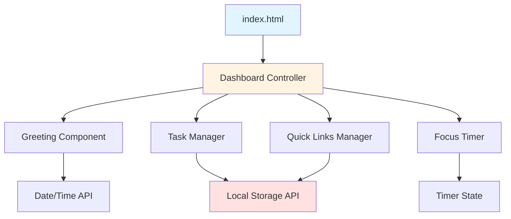

# Design Document: To-Do List Life Dashboard

## Overview

The To-Do List Life Dashboard is a single-page web application built with vanilla JavaScript, HTML, and CSS. It provides a minimal, distraction-free interface for personal productivity, combining task management, time awareness, and quick navigation tools.

The application architecture follows a client-side MVC pattern where:
- **Model**: JavaScript objects representing tasks, links, and timer state
- **View**: DOM manipulation for rendering UI components
- **Controller**: Event handlers and business logic coordinating model updates and view rendering

All data persistence uses the browser's Local Storage API, making the application fully functional offline with no backend dependencies. The design prioritizes simplicity, fast load times, and immediate user feedback.

## Architecture

### High-Level Structure



### Component Responsibilities

1. **Dashboard Controller**: Initializes all components, coordinates data flow, manages Local Storage operations
2. **Greeting Component**: Displays time, date, and time-based greeting; updates every second
3. **Task Manager**: Handles CRUD operations for tasks, manages task state, syncs with Local Storage
4. **Focus Timer**: Implements 25-minute countdown timer with start/stop/reset controls
5. **Quick Links Manager**: Manages user-defined website shortcuts with CRUD operations

### Data Flow

1. **Initialization**: Dashboard loads → retrieve data from Local Storage → deserialize → render UI
2. **User Actions**: User interaction → update model → persist to Local Storage → update view
3. **Time Updates**: setInterval → update time display → check for greeting changes

## Components and Interfaces

### Dashboard Controller

```javascript
class Dashboard {
  constructor()
  init()
  loadFromStorage()
  saveToStorage(key, data)
}
```

**Responsibilities**:
- Initialize all child components
- Coordinate Local Storage read/write operations
- Provide shared utilities for serialization/deserialization

### Greeting Component

```javascript
class GreetingComponent {
  constructor(containerElement)
  updateTime()
  getGreeting(hour)
  render()
}
```

**Responsibilities**:
- Display current time in 12-hour format
- Display current date with day of week
- Determine and display time-appropriate greeting
- Update display every second via setInterval

**Time Period Logic**:
- Morning: 5:00 AM - 11:59 AM → "Good Morning"
- Afternoon: 12:00 PM - 5:59 PM → "Good Afternoon"
- Evening: 6:00 PM - 4:59 AM → "Good Evening"

### Task Manager

```javascript
class TaskManager {
  constructor(containerElement)
  addTask(text)
  editTask(id, newText)
  toggleComplete(id)
  deleteTask(id)
  getTasks()
  loadTasks(tasksData)
  render()
}

class Task {
  constructor(id, text, completed = false, createdAt = Date.now())
  toJSON()
  static fromJSON(data)
}
```

**Responsibilities**:
- Maintain array of Task objects
- Validate task text (non-empty)
- Provide CRUD operations
- Serialize/deserialize task collection
- Render task list with completion status indicators

**Task Data Structure**:
```javascript
{
  id: string,           // UUID or timestamp-based
  text: string,         // Task description
  completed: boolean,   // Completion status
  createdAt: number     // Timestamp
}
```

### Focus Timer

```javascript
class FocusTimer {
  constructor(containerElement)
  start()
  stop()
  reset()
  tick()
  formatTime(seconds)
  render()
}
```

**Responsibilities**:
- Manage countdown from 25 minutes (1500 seconds)
- Provide start/stop/reset controls
- Display time in MM:SS format
- Emit notification when timer reaches zero
- Use setInterval for countdown updates

**Timer State**:
```javascript
{
  duration: 1500,        // 25 minutes in seconds
  remaining: number,     // Current remaining seconds
  isRunning: boolean,    // Timer active state
  intervalId: number     // setInterval reference
}
```

### Quick Links Manager

```javascript
class QuickLinksManager {
  constructor(containerElement)
  addLink(label, url)
  deleteLink(id)
  getLinks()
  loadLinks(linksData)
  validateUrl(url)
  render()
}

class QuickLink {
  constructor(id, label, url)
  toJSON()
  static fromJSON(data)
}
```

**Responsibilities**:
- Maintain array of QuickLink objects
- Validate label (non-empty) and URL (valid format)
- Provide add/delete operations
- Serialize/deserialize link collection
- Render clickable links that open in new tabs

**Link Data Structure**:
```javascript
{
  id: string,      // UUID or timestamp-based
  label: string,   // Display text
  url: string      // Valid URL
}
```

## Data Models

### Local Storage Schema

The application uses three Local Storage keys:

1. **`dashboard_tasks`**: JSON array of task objects
```json
[
  {
    "id": "1234567890",
    "text": "Complete project proposal",
    "completed": false,
    "createdAt": 1234567890000
  }
]
```

2. **`dashboard_links`**: JSON array of link objects
```json
[
  {
    "id": "0987654321",
    "label": "GitHub",
    "url": "https://github.com"
  }
]
```

3. **`dashboard_theme`** (optional): String value for theme preference
```json
"dark"
```

### Serialization Strategy

- Use `JSON.stringify()` for serialization
- Use `JSON.parse()` for deserialization
- Implement `toJSON()` methods on Task and QuickLink classes
- Implement static `fromJSON()` factory methods for reconstruction
- Handle missing or corrupted data gracefully (default to empty arrays)

### Data Validation

**Task Text Validation**:
- Must not be empty string
- Must not be only whitespace
- Trim whitespace before storage

**URL Validation**:
- Must match URL pattern (http:// or https://)
- Use browser's URL constructor for validation
- Reject invalid URLs before storage


## Correctness Properties

*A property is a characteristic or behavior that should hold true across all valid executions of a system—essentially, a formal statement about what the system should do. Properties serve as the bridge between human-readable specifications and machine-verifiable correctness guarantees.*

### Property 1: Time Display Format

*For any* point in time, when the greeting component renders the time, the output SHALL contain the time in 12-hour format (1-12) with AM/PM indicator.

**Validates: Requirements 1.1**

### Property 2: Date Display Completeness

*For any* date, when the greeting component renders the date, the output SHALL contain the day of week, month name, and day number.

**Validates: Requirements 1.2**

### Property 3: Time-Based Greeting Correctness

*For any* time of day, the greeting function SHALL return "Good Morning" for times between 5:00 AM and 11:59 AM, "Good Afternoon" for times between 12:00 PM and 5:59 PM, and "Good Evening" for times between 6:00 PM and 4:59 AM.

**Validates: Requirements 2.1, 2.2, 2.3**

### Property 4: Timer Format Consistency

*For any* number of seconds between 0 and 1500, the timer format function SHALL produce output in MM:SS format where MM is zero-padded minutes and SS is zero-padded seconds.

**Validates: Requirements 3.6**

### Property 5: Timer Stop Preserves State

*For any* timer state with remaining time, when the stop operation is executed, the remaining time SHALL be unchanged.

**Validates: Requirements 3.3**

### Property 6: Timer Reset Returns to Initial State

*For any* timer state, when the reset operation is executed, the remaining time SHALL be set to 1500 seconds (25 minutes).

**Validates: Requirements 3.4**

### Property 7: Task Addition Increases Collection Size

*For any* task list and any valid (non-whitespace) task text, when a task is added, the task list length SHALL increase by one and the new task SHALL be present in the collection.

**Validates: Requirements 4.1**

### Property 8: Whitespace Task Text Rejection

*For any* string composed entirely of whitespace characters (including empty string), when submitted as task text for add or edit operations, the operation SHALL be rejected and the task list SHALL remain unchanged.

**Validates: Requirements 4.3, 5.4**

### Property 9: Task Edit Updates Text

*For any* existing task and any valid (non-whitespace) new text, when the edit operation is executed, the task's text SHALL be updated to the new value.

**Validates: Requirements 5.2**

### Property 10: Task Completion Toggle

*For any* task, when the toggle completion operation is executed, the task's completed status SHALL change from false to true or from true to false, and executing toggle twice SHALL return the task to its original completion state.

**Validates: Requirements 6.1, 6.4**

### Property 11: Completed Task Visual Indication

*For any* task with completed status set to true, when the task is rendered, the output SHALL contain a visual indicator of completion (such as a CSS class or style attribute).

**Validates: Requirements 6.3**

### Property 12: Task Deletion Removes from Collection

*For any* task list containing a specific task, when that task is deleted, the task SHALL no longer be present in the collection and the list length SHALL decrease by one.

**Validates: Requirements 7.1**

### Property 13: Task Serialization Round-Trip

*For any* valid collection of tasks, serializing the collection to JSON and then deserializing it SHALL produce an equivalent collection where each task has the same id, text, completed status, and createdAt timestamp.

**Validates: Requirements 8.1, 8.2, 8.3, 8.4**

### Property 14: Quick Link Addition Increases Collection Size

*For any* link list and any valid label (non-empty) and valid URL, when a link is added, the link list length SHALL increase by one and the new link SHALL be present in the collection.

**Validates: Requirements 9.1**

### Property 15: Invalid Link Rejection

*For any* link submission where the label is empty or the URL is invalid (does not match http:// or https:// protocol), the submission SHALL be rejected and the link list SHALL remain unchanged.

**Validates: Requirements 9.5**

### Property 16: Link Deletion Removes from Collection

*For any* link list containing a specific link, when that link is deleted, the link SHALL no longer be present in the collection and the list length SHALL decrease by one.

**Validates: Requirements 9.4**

### Property 17: Link Serialization Round-Trip

*For any* valid collection of quick links, serializing the collection to JSON and then deserializing it SHALL produce an equivalent collection where each link has the same id, label, and url.

**Validates: Requirements 10.1, 10.2, 10.3, 10.4**

## Error Handling

### Input Validation Errors

**Empty Task Text**:
- Trigger: User submits empty or whitespace-only task text
- Response: Reject submission silently or display inline validation message
- State: Task list remains unchanged
- Recovery: User can retry with valid input

**Invalid URL**:
- Trigger: User submits malformed URL for quick link
- Response: Display validation error message near URL input field
- State: Link list remains unchanged
- Recovery: User can correct URL format and resubmit

**Empty Link Label**:
- Trigger: User submits quick link with empty label
- Response: Display validation error message near label input field
- State: Link list remains unchanged
- Recovery: User can provide label and resubmit

### Storage Errors

**Local Storage Unavailable**:
- Trigger: Browser has Local Storage disabled or quota exceeded
- Response: Display warning banner indicating data will not persist
- State: Application continues to function with in-memory storage only
- Recovery: User can enable Local Storage or clear space

**Corrupted Storage Data**:
- Trigger: JSON.parse() fails when loading from Local Storage
- Response: Log error to console, initialize with empty collections
- State: Start with fresh empty task and link lists
- Recovery: User rebuilds their data (previous data is lost)

### Timer Errors

**Timer Completion**:
- Trigger: Timer reaches zero
- Response: Play browser notification sound (if permitted), display visual indicator
- State: Timer stops at 00:00
- Recovery: User can reset timer to start new session

### Browser Compatibility Errors

**Unsupported Browser Features**:
- Trigger: Browser lacks Local Storage API or modern JavaScript features
- Response: Display error message recommending browser upgrade
- State: Application may not function correctly
- Recovery: User upgrades browser or uses supported browser

## Testing Strategy

### Overview

The testing strategy employs a dual approach combining unit tests for specific examples and edge cases with property-based tests for comprehensive validation of universal behaviors. This ensures both concrete correctness and general robustness across all possible inputs.

### Property-Based Testing

**Framework**: Use **fast-check** library for JavaScript property-based testing

**Configuration**:
- Minimum 100 iterations per property test
- Each test tagged with comment referencing design property
- Tag format: `// Feature: todo-list-life-dashboard, Property N: [property description]`

**Property Test Coverage**:

1. **Time and Date Formatting** (Properties 1-3):
   - Generate random timestamps
   - Verify 12-hour format, AM/PM indicator
   - Verify date components present
   - Verify greeting matches time period

2. **Timer Operations** (Properties 4-6):
   - Generate random timer states (0-1500 seconds)
   - Verify format output structure
   - Verify stop preserves state
   - Verify reset returns to 1500

3. **Task Operations** (Properties 7-13):
   - Generate random task collections
   - Generate random valid and invalid task text
   - Verify add/edit/delete operations
   - Verify completion toggle idempotence
   - Verify serialization round-trip

4. **Link Operations** (Properties 14-17):
   - Generate random link collections
   - Generate random valid and invalid URLs
   - Verify add/delete operations
   - Verify serialization round-trip

**Example Property Test Structure**:
```javascript
// Feature: todo-list-life-dashboard, Property 13: Task Serialization Round-Trip
test('task serialization round-trip preserves data', () => {
  fc.assert(
    fc.property(
      fc.array(taskArbitrary()),
      (tasks) => {
        const serialized = JSON.stringify(tasks);
        const deserialized = JSON.parse(serialized);
        return deepEqual(tasks, deserialized);
      }
    ),
    { numRuns: 100 }
  );
});
```

### Unit Testing

**Framework**: Use **Jest** or **Vitest** for unit testing

**Unit Test Focus Areas**:

1. **Specific Examples**:
   - Timer initializes to exactly 25 minutes (1500 seconds)
   - Specific time "10:30 AM" formats correctly
   - Specific date "Monday, January 15" displays correctly
   - Empty string task submission is rejected

2. **Edge Cases**:
   - Timer at 0 seconds emits notification
   - Task list with 0 tasks handles operations correctly
   - Link list with 0 links handles operations correctly
   - Midnight (00:00) displays as "12:00 AM"
   - Noon (12:00) displays as "12:00 PM"

3. **Integration Points**:
   - Dashboard initialization loads from Local Storage
   - Task manager updates trigger Local Storage writes
   - Link manager updates trigger Local Storage writes
   - Timer interval updates display correctly

4. **Error Conditions**:
   - Corrupted JSON in Local Storage handled gracefully
   - Missing Local Storage keys default to empty arrays
   - Invalid URL format rejected by validation
   - Whitespace-only strings rejected by validation

**Test Organization**:
```
tests/
  ├── unit/
  │   ├── greeting.test.js
  │   ├── timer.test.js
  │   ├── task-manager.test.js
  │   └── quick-links.test.js
  └── properties/
      ├── greeting.properties.test.js
      ├── timer.properties.test.js
      ├── task-manager.properties.test.js
      └── quick-links.properties.test.js
```

### Testing Balance

- **Unit tests**: Focus on specific examples, edge cases, and integration points
- **Property tests**: Verify universal behaviors across all possible inputs
- Avoid writing excessive unit tests for cases covered by property tests
- Property tests provide comprehensive input coverage through randomization
- Unit tests provide concrete examples that demonstrate correct behavior

### Manual Testing

**Browser Compatibility**:
- Test in Chrome 90+, Firefox 88+, Edge 90+, Safari 14+
- Verify layout and functionality in each browser
- Test Local Storage persistence across browser sessions

**Performance Validation**:
- Verify initial load completes within 1 second
- Verify task operations update UI within 100ms
- Verify timer updates display every second without lag

**Accessibility**:
- Test keyboard navigation for all interactive elements
- Verify screen reader compatibility
- Test with browser zoom at 200%

